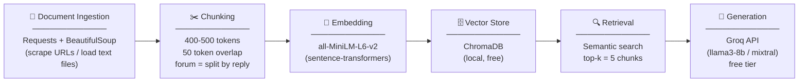

# Project 1 Planning: The Unofficial Guide

> Write this document before you write any pipeline code.
> Your spec and architecture diagram are what you'll use to direct AI tools (Claude, Copilot, etc.) to generate your implementation — the more specific they are, the more useful the generated code will be.
> Update the Retrieval Approach and Chunking Strategy sections if you change your approach during implementation.
> Update this file before starting any stretch features.

---

## Domain

<!-- What domain did you choose? Why is this knowledge valuable and hard to find through official channels? -->
The chosen domain is Elective courses in Science and Engineering majors at Rutgers Univeristy. A lot of STEM majors, including me struggle to find elective courses, that is a certain number of courses a student has to take after they are done with the required courses for their major. This information is valuable and hard to find because each student has their own filters/parameters for their courses such as a student might want easy A courses that overlap with their other major/minor, while another student might wantto value those that give him knowledge and education that is helpful post grad. It is also difficult to find because each student has their own opinions given the factors. OR

The chosen domanin is career pathways related to Computer Science that are not just Software Engineering. A lot of kids fresh out of highschool, come into college undecided and eventually endup doing a Computer Science major, which they may or may not essentially enjoy. So this is for those kids out these that are "stuck" doing the major, they can find roles/career pathways do not entirely deviate from the CS degree, but are closely related such as Visual Effects in the entertainment industry or UI/UX which is making interactive user experience. This information is in my opinion hard to find through official channels because not all the universities offer a variety of courses that overlap with the CS major. The information is valuable as well since a litlle information and awareness can change thhe course of a student's life.
---

## Documents

<!-- List your specific sources: URLs, subreddit names, forum threads, or file descriptions.
     Aim for at least 10 sources that together cover different subtopics or perspectives within your domain. -->

| # | Source | Description | URL or location |
|---|--------|-------------|-----------------|
| 1 | CS career questions subreddit|It is helpful for looking up questions about the industry from those who are entering to those that are already working in the field |https://www.reddit.com/r/cscareerquestions/ | 
| 2 | Awsome subreddits list |A big list of related subreddiys, listed by categories like programming, career, front end dev etc. | https://github.com/iCHAIT/awesome-subreddits|
| 3 | The Muse – CS Degree Jobs|Career counselor perspective on 9+ roles CS majors can pursue outside software development |https://www.themuse.com/advice/computer-science-degree-major-jobs |
| 4 |Collegewise – Alternative Pathways in CS |Discusses how skills like problem-solving and HCI travel across majors and roles |https://go.collegewise.com/alternative-pathways-to-a-career-in-computer-science |
| 5 |ScreenSkills – Careers in VFX |UK industry body with a full career map for VFX roles — covers programming-heavy roles too |https://www.screenskills.com/job-profiles/browse/visual-effects-vfx/ |
| 6 |GitHub – Awesome Cybersecurity Subreddits |Curated list of cybersecurity subreddits (r/netsec, r/cybersecurity, r/cissp, etc.) |https://github.com/d0midigi/awesome-cybersecurity-subreddits |
| 7 |CareerExplorer |Career profiles with skill and personality matches |https://www.careerexplorer.com/careers/?page=2&utm_ |
| 8 |Teamblind – "Non-SWE career opportunities for CS major" |Anonymous forum thread: CS grad with 4.0 who found SWE "boring and isolating" asks for alternatives; community replies cover PM, consulting, solutions engineering  |https://www.teamblind.com/post/non-swe-career-opportunities-for-cs-major-bh4qscys |
| 9 |Everything Technical Writing – Career Guide |Covers technical writer sub-roles (developer advocate, UX writer, API documentation, content marketer) with salaries and how to enter from a CS background | |https://www.everythingtechnicalwriting.com/everything-you-need-to-know-about-technical-writing/  |
| 10 |UChicago – Careers in Gaming |Lists every role in the games industry beyond programming: narrative designer, sound designer, game analyst, VFX artist, UX researcher, producer — shows breadth CS students don't know exists  |https://careeradvancement.uchicago.edu/careers-in/gaming/ |

---

## Chunking Strategy

<!-- How will you split documents into chunks?
     State your chunk size (in tokens or characters), overlap size, and explain why those
     numbers fit the structure of your documents.
     A review-heavy corpus warrants different chunking than a long FAQ. -->

**Chunk size:**
400–500 tokens (~300–400 words)  
**Overlap:**
50–75 tokens (~1–2 sentences)
**Reasoning:**

My sources are a mix of forum threads (Reddit, Teamblind), career guide articles
(Extern, The Muse), and career map pages (ScreenSkills, UChicago). The 400–500
token range is large enough to capture one complete idea — like a full description
of what a UX researcher does, or one person's career pivot story — without bleeding
into unrelated content from the same page.

Forum replies are already natural chunks; most are 100–400 tokens, so I'll chunk
by reply rather than by token count for those. For long articles I'll use the sliding
window. For career map pages I'll chunk by role/section.

The 50-token overlap protects against a key sentence falling right on a boundary.
Without it, a chunk ending mid-thought ("I had a CS degree and hated SWE, so I
tried...") would lose the resolution ("...UX design at a game studio"), making it
unretrievable for the query that needs it.

**Too small** would look like: retrieved chunks that have a job title but no context
about what the job actually is. **Too large** would look like: one chunk describing
three different careers, surfacing for every query regardless of specificity.
---

## Retrieval Approach

<!-- Which embedding model are you using (e.g., all-MiniLM-L6-v2 via sentence-transformers)?
     How many chunks will you retrieve per query (top-k)?
     If you were deploying this for real users and cost wasn't a constraint, what tradeoffs
     would you weigh in choosing a different embedding model — context length, multilingual
     support, accuracy on domain-specific text, latency? -->

**Embedding model:** `all-MiniLM-L6-v2` via sentence-transformers  

**Top-k:** 5

**Production tradeoff reflection:**
5 chunks gives the LLM enough context to synthesize a real answer without
overwhelming it with noise. Too few (k=2) risks missing the one chunk that actually
answers the question. Too many (k=10+) risks diluting the context with loosely
related chunks, making the answer vague.

Semantic search works by converting both the query and the documents into vectors
that represent meaning, not just words. So a query like "what jobs can I get if I
hate coding?" can still match a chunk that says "non-engineering roles for CS
graduates" because they're close in meaning-space even with no shared words.
---

## Evaluation Plan

<!-- List your 5 test questions with their expected correct answers.
     Questions should be specific enough that you can judge whether the system's response
     is right or wrong. "What are good dining halls?" is too vague.
     "What do students say about wait times at [dining hall name] during lunch?" is testable. -->

| # | Question | Expected answer |
|---|----------|-----------------|
| 1 |What does a UX researcher actually do day to day? |Designs user studies, analyzes behavior data, presents findings to product teams; doesn't require coding |
| Designs user studies, analyzes behavior data, presents findings to product teams; doesn't require coding |
| 2 |How did someone with a CS degree break into UX design without a design background? | Sources like the Design Buddies story describe building a portfolio, joining design communities, and applying to entry-level roles after being ghosted many times|
| 3 |What VFX roles are available to someone with a CS/programming background?|Pipeline TD, rendering engineer, compositor — ScreenSkills describes technical roles alongside creative ones|
| 4 |What is the difference between a UX designer and a UX researcher?|Designer focuses on visual/interaction output; researcher focuses on user studies, interviews, and translating findings into product decisions|
| 5 |What non-SWE careers do CS students on forums actually talk about switching to?|Product management, UX/design, solutions engineering, technical writing — based on Teamblind/Reddit thread content|

---

## Anticipated Challenges

<!-- What could go wrong? Name at least two specific risks with reasoning.
     Consider: noisy or inconsistent documents, missing source attribution, off-topic
     retrieval, chunks that split key information across boundaries. -->

**1. Chunks that split a career story mid-thought.**  
Personal narrative sources (like the Design Buddies article) tell a story across
multiple paragraphs. If chunked poorly, one chunk has the problem ("I hated SWE")
and another has the solution ("I became a UX designer at EA") — and only one gets
retrieved. The 50-token overlap reduces this but doesn't eliminate it.

**2. Forum threads mixing multiple career paths in one reply.**  
A Teamblind reply might say "consider PM, solutions engineering, or UX — all work
for CS grads." If that chunk is retrieved for a query about PM specifically, the
answer will be noisy and unfocused. Filtering or metadata-tagging chunks by career
domain could help, but adds complexity.

---

## Architecture

<!-- Draw a diagram of your pipeline showing the five stages:
     Document Ingestion → Chunking → Embedding + Vector Store → Retrieval → Generation
     Label each stage with the tool or library you're using.
     You can use ASCII art, a Mermaid diagram, or embed a sketch as an image.
     You'll use this diagram as context when prompting AI tools to implement each stage. -->

---

## AI Tool Plan

<!-- For each part of the pipeline below, describe:
     - Which AI tool you plan to use (Claude, Copilot, ChatGPT, etc.)
     - What you'll give it as input (which sections of this planning.md, which requirements)
     - What you expect it to produce
     - How you'll verify the output matches your spec

     "I'll use AI to help me code" is not a plan.
     "I'll give Claude my Chunking Strategy section and ask it to implement chunk_text()
     with my specified chunk size and overlap" is a plan. -->

## AI Tool Plan

| Pipeline Part | What I'll give the AI | What I expect it to produce |
|---|---|---|
| `chunk_text()` function | My chunking strategy section above + a sample document | Python function that splits text into 400–500 token chunks with 50-token overlap, with a special case for forum threads (split by reply) |
| Embedding + vector store setup | The retrieval approach section + instruction to use `sentence-transformers` and a simple in-memory vector store (ChromaDB) | Boilerplate code to embed chunks and store/query them |
| RAG query function | The retrieval approach section + Groq API docs | Function that takes a user question, retrieves top-5 chunks, and sends them to Groq with a prompt template |
| Evaluation script | The 5 test questions and expected answers above | Script that runs each question through the RAG pipeline and prints the answer next to the expected answer for manual comparison 

## Architecture
## Architecture

**Milestone 3 — Ingestion and chunking:**

**Milestone 4 — Embedding and retrieval:**

**Milestone 5 — Generation and interface:**
